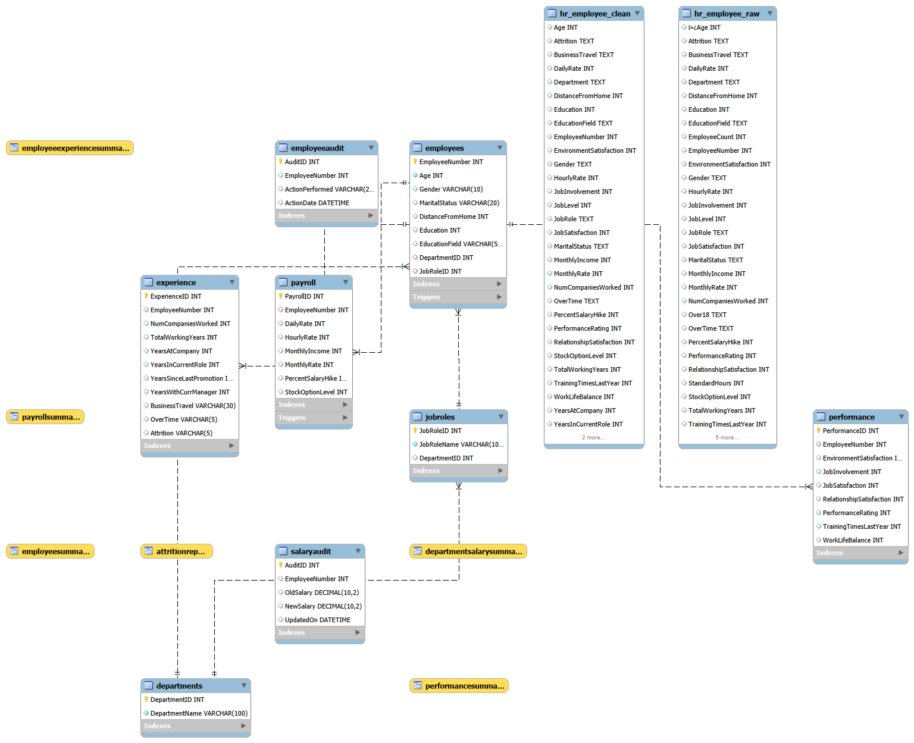

# HR Database Management using SQL

A comprehensive SQL project that demonstrates database design, data cleaning, normalization, advanced SQL querying, and HR analytics using a real-world HR dataset from Kaggle.

---

# 📌 Project Overview

This project is built using the **IBM HR Analytics Employee Attrition Dataset** from Kaggle. It demonstrates the complete SQL development lifecycle, from importing raw data to designing a normalized relational database and generating meaningful HR business insights.

The project covers:

- Importing raw HR data into MySQL
- Data cleaning and validation
- Database normalization (3NF)
- Advanced SQL querying
- Views, Stored Procedures, Triggers, and Indexes
- HR analytics and reporting

---

# 🛠️ Technologies Used

- MySQL
- MySQL Workbench
- SQL
- Git
- GitHub

---

# 📂 Dataset

**Source:** IBM HR Analytics Employee Attrition Dataset (Kaggle)

### Dataset Statistics

- Total Records: **1470**
- Total Columns: **35**
- Database: **MySQL**
- Domain: **Human Resources (HR)**

---

# 🔄 ETL Workflow

```
Raw Dataset
      │
      ▼
Staging Table
      │
      ▼
Data Cleaning
      │
      ▼
Database Normalization (3NF)
      │
      ▼
Advanced SQL Analysis
      │
      ▼
Business Reports
```

---

# 🗄️ Database Design

The database was normalized into the following relational tables:

- Employees
- Departments
- JobRoles
- Payroll
- Performance
- Experience

---

# 📄 Entity Relationship (ER) Diagram

The following ER diagram represents the normalized database schema and relationships between all tables.

> **ER Diagram Location:** `ER_Diagram/HR_Database_ER_Diagram.png`



---

# 📚 SQL Concepts Covered

This project demonstrates the following SQL concepts:

- SELECT
- WHERE
- ORDER BY
- GROUP BY
- HAVING
- Aggregate Functions
- INNER JOIN
- Subqueries
- Common Table Expressions (CTEs)
- Window Functions
- Views
- Stored Procedures
- Triggers
- Indexes

---

# 📁 Project Structure

```
HR-Database-Management-SQL/
│
├── Dataset/
│   ├── Raw_Data/
│   ├── Cleaned_Data/
│   └── Normalized_Data/
│
├── SQL/
│   ├── 01_Create_Database.sql
│   ├── 02_Create_Staging_Table.sql
│   ├── 03_Data_Cleaning.sql
│   ├── 04_Normalization.sql
│   ├── 05_Basic_Queries.sql
│   ├── 06_Joins.sql
│   ├── 07_Subqueries_CTE.sql
│   ├── 08_Window_Functions.sql
│   ├── 09_Views.sql
│   ├── 10_Stored_Procedures.sql
│   ├── 11_Triggers.sql
│   └── 12_Indexes.sql
│
├── ER_Diagram/
├── Reports/
├── Screenshots/
├── README.md
├── LICENSE
└── .gitignore
```

---

# ⭐ Key Features

- Imported a real-world HR dataset from Kaggle
- Cleaned and validated raw employee data
- Designed a normalized relational database (3NF)
- Created multiple related database tables
- Implemented advanced SQL queries
- Developed reusable SQL Views
- Created Stored Procedures for HR operations
- Implemented Triggers for audit logging and data validation
- Optimized query performance using Indexes
- Generated HR business reports and analytics

---

# 📊 Business Insights Generated

The project answers several HR business questions, including:

- Employee distribution across departments
- Department-wise average salary
- Highest-paid employees
- Employee attrition analysis
- Overtime analysis
- Employee performance analysis
- Salary distribution
- Experience and tenure analysis
- Job role analysis
- Work-life balance insights

---

# 📷 Project Screenshots

The **Screenshots** folder contains images demonstrating:

- Database Schema
- SQL Query Results
- Views
- Stored Procedures
- Triggers
- Indexes
- ER Diagram

---

# 🚀 Future Enhancements

- Build an HR Analytics Dashboard using Power BI
- Perform HR analytics using Python (Pandas)
- Develop REST APIs using Flask
- Deploy the database on a cloud platform
- Implement role-based access control
- Automate the ETL pipeline

---

# 👨‍💻 Author

**Rakesh Yadav Podamekala**

**GitHub:**  
https://github.com/Rakeshyadav2005

**LinkedIn:**  
*(Add your LinkedIn profile URL here)*

---

# 📜 License

This project is licensed under the **MIT License**.